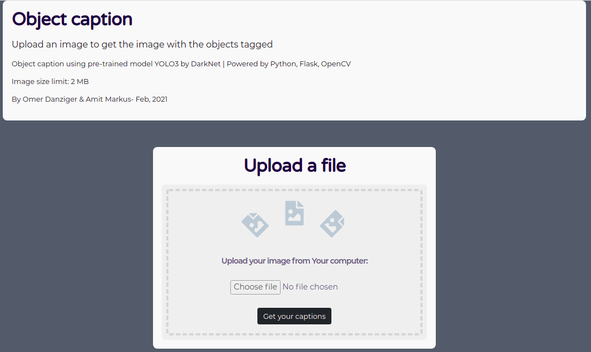
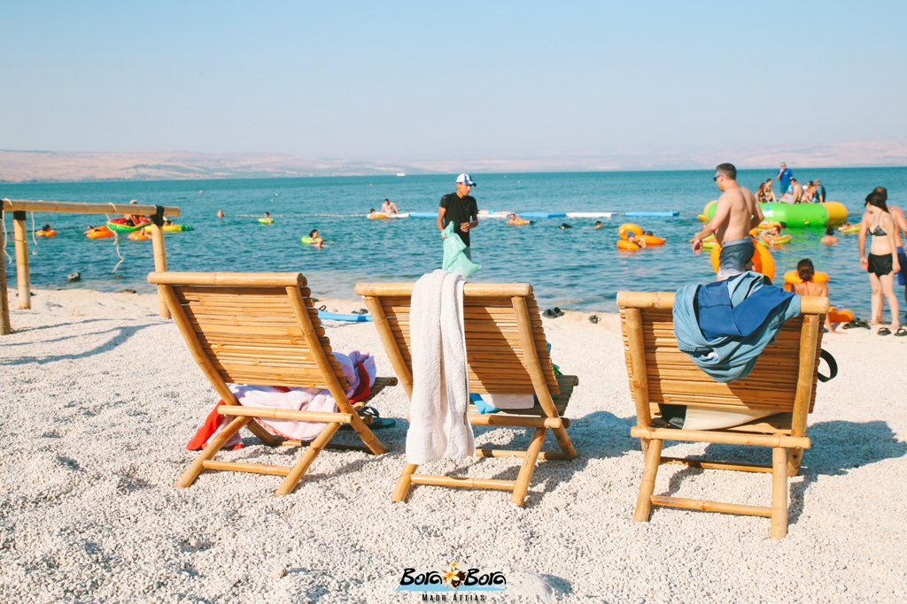
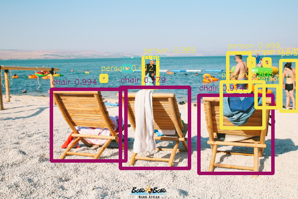

# Image-caption-dnz

This project let you use YOLO3 model by DarkNet in order you tag photos with the object in it.

## Hosting on Heroku

Try it [here](https://image-caption-dnz.herokuapp.com/).

## Run locally

If you want to run it locally, you must download the weights with

`! wget https://pjreddie.com/media/files/yolov3.weights`

## Instructions

run main.py or get in herokuapp page.

Click on "Choose file" and select the photo you would like to tag.

Click on "Get your captions" and in a few moments you will get your photo with the correct tags.

